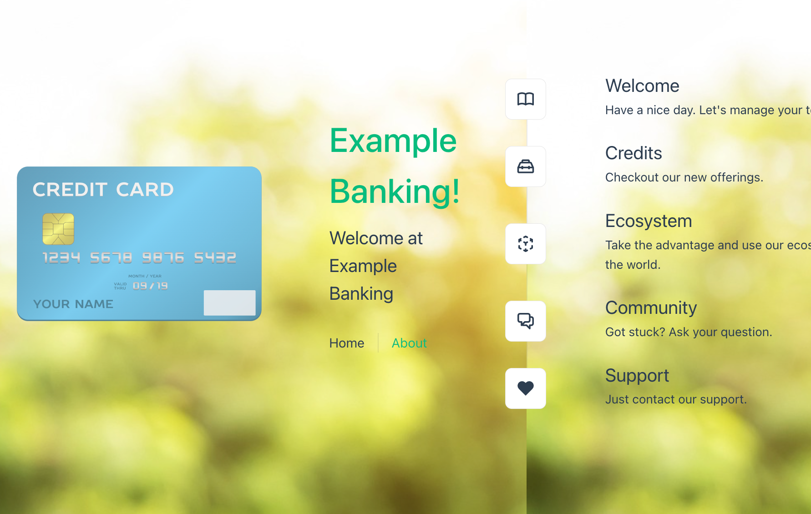

# Example WebApp build on Vue.js

This repository contains a sample [Vue.js](https://vuejs.org) application called `"Example Banking"`.



The example application can run locally as native Vue.js application and in a container ([Podman](https://podman.io/)), where an [Nginx](https://www.nginx.com) is used as the webserver for the [Vue.js](https://vuejs.org) webapplication. You can also deploy the application to [`IBM Cloud Code Engine`](https://cloud.ibm.com/docs/codeengine).

The example application is also prepared to be integrated with [`IBM Cloud Watson Assistant`](https://cloud.ibm.com/catalog/services/watson-assistant#about). 

You can also create your own TLS certification with [cert bot](https://certbot.eff.org/) and [Lets Encrypt](https://letsencrypt.org/). You can use [`IBM Cloud Code Engine` domain mapping](https://cloud.ibm.com/docs/codeengine?topic=codeengine-domain-mappings) to map your custom domain.

### Step 1: Clone the example project to your local computer

```sh
git clone https://github.com/thomassuedbroecker/vue-simple-webapp
cd vue-simple-webapp/code
```

### Step 2:  Set the needed environ `.env` file

```sh
cat .env-template > .env
```

Edit the `.env` file.

```sh
ASSISTANT_INTEGRATION_ID="YOUR_ID" 
ASSISTANT_REGION="YOUR_REGION"
ASSISTANT_SERVICE_INSTANCE_ID="YOUR_SERVICE_INSTANCE"
ROOTFOLDER="YOUR_ROOTFOLDER" #Location on your local machine
MYPROJECT="YOUR_MYPROJECT" #Code Engine project name
RESOURCE_GROUP="default" #IBM Cloud resource group
REGION="YOUR_REGION" #IBM Cloud region
CERT_EMAIL="YOUR_EMAIL" # If you want to create a TLS certification
CERT_DOMAIN="YOUR_DOMAIN" # If you want to create a TLS certification
```

### Step 3: Run the application locally

```sh
  npm install
  npm run lint
  npm run dev
```

### Step 4: Run the application locally as a container

```sh
sh build-and-verify-container.sh
```

### Step 5: Push the container to a container registry

```sh
sh build-push-container.sh
```

### Step 6: Deploy the application to Code Engine

```sh
ibmcloud login
sh deploy-application.sh
```

### Step 7: Create a TLS cert for a domain

```sh
create-cert.sh
```
